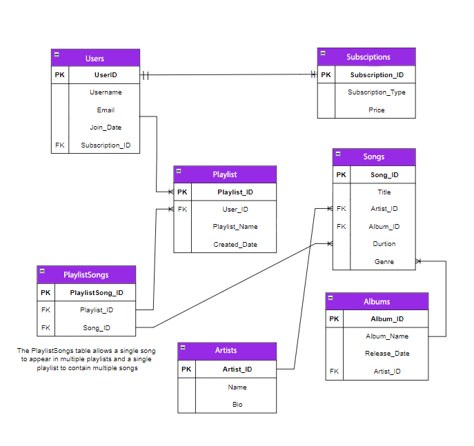

# Tunify Platform

Tunify Platform is a web application designed to manage and interact with music-related data. It integrates various entities such as users, subscriptions, playlists, songs, artists, albums, and playlist songs into a cohesive system.

Entity Relationships

User: Represents an individual using the platform.

Subscription: Links users to their subscription plans.

Playlist: Contains collections of songs created by users.

Song: Individual music tracks.

Artist: Represents musicians or groups.

Album: Groups of songs released together by artists.

PlaylistSongs: Links songs to playlists, allowing multiple songs in each playlist.

Each entity is related through foreign keys and navigational properties as depicted in the ERD, ensuring proper data management and relationships.

The Repository Design Pattern is a structural pattern that abstracts data access logic by encapsulating it within repository classes. It provides a layer between the data access code and the business logic, promoting a cleaner separation of concerns.

### **Benefits of Repository Design Pattern**

1. **Separation of Concerns**: Keeps data access logic separate from business logic, making code easier to manage and test.
2. **Abstraction**: Hides the complexities of data access, allowing for easier changes to data storage mechanisms without affecting the rest of the application.
3. **Code Reusability**: Provides a consistent interface for data operations, which can be reused across different parts of the application.
4. **Improved Testability**: Facilitates unit testing by allowing mock repositories to be used in tests.

### Swagger UI Integration

Overview
Swagger UI provides an interactive interface to explore and test API endpoints. It generates documentation automatically based on your API code.

Accessing Swagger UI
Run the Project: Start your project (e.g., dotnet run).
Open a Browser: Navigate to http://localhost:<port>/swagger, replacing <port> with your application’s port number.
Using Swagger UI
Explore Endpoints: View and interact with API endpoints.
Test Requests: Use the "Try it out" feature to send requests and see responses.

### Identity Setup Instructions

#### Overview

This section describes how to use the registration, login, and logout features implemented in the Tunify Platform using ASP.NET Core Identity.

#### Setting Up Identity

Install Required Package:

Use NuGet Package Manager to install:

Microsoft.AspNetCore.Identity.EntityFrameworkCore

#### Configuration:

In the Program.cs file:

Add Identity services:

`builder.Services.AddIdentity<IdentityUser, IdentityRole>()
    .AddEntityFrameworkStores<TunifyDbContext>();`

Add Authentication middleware:

`app.UseAuthentication();`

User Registration:
Users can register by sending a POST request to the /Account/Register endpoint with the required details.

User Login:
To log in, users should send a POST request to the /Account/Login endpoint with their credentials.

User Logout:
Users can log out by sending a POST request to the /Account/Logout endpoint.

Error Handling
The application provides user-friendly error messages and logs errors for troubleshooting.
